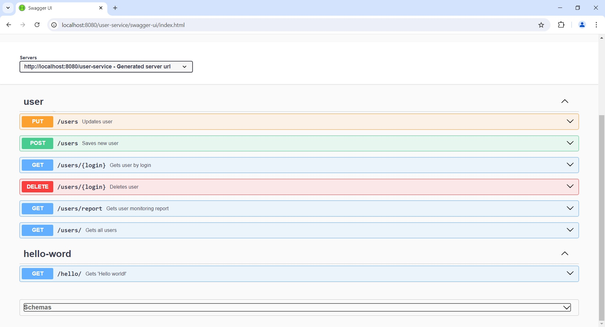

# Документирование REST API сервиса регистрации пользователей

Реализовано автоматическое документирование REST API сервиса регистрации пользователей по стандарту Open API.

##API Docs
*http://localhost:8080/user-service/api-docs*

##Swagger
*http://localhost:8080/user-service/api-docs-ui*

###Контроллеры

Вызов Hello world

Получение данных несуществующего пользователя

###Схемы

