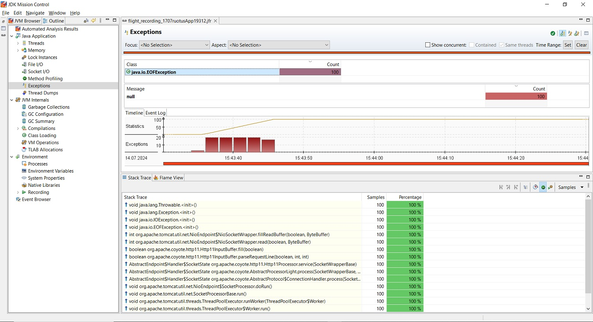

# Анализ thread dump с помощью JFR

Проведено нагрузочное тестирование сервиса регистрации пользователей для процесса удаления несуществующего пользователя с профилированием с помощью JFR.

## Параметры плана тестирования
* Количество пользователей: 100
* Запуск запросов всех пользователей: в течение 10 секунд
* Количество повторений: 1

[План тестирования прилагается](user_service_delete.jmx)

## Результаты

Обнаружена ошибка NullPointerException при выполнении каждого запроса

## Вывод

Stack trace показвает, что ошибка возникает в сервисе UserMonitoringServiceImpl при вызове метода stop.
Метод вызывается из UserController при удалении пользователя.
Ошибка связана с попыткой вызова методов объекта monitoringRunningTask, получаемого из ConcurrentHashMap users, в случае, когда monitoringRunningTask == null.

## Решение

В методе stop сервиса UserMonitoringServiceImpl работать с monitoringRunningTask только если значение не равно null.

## Результат

Повторный запуск нагрузочного теста после доработки сервиса UserMonitoringServiceImpl показывает следующие результаты.

