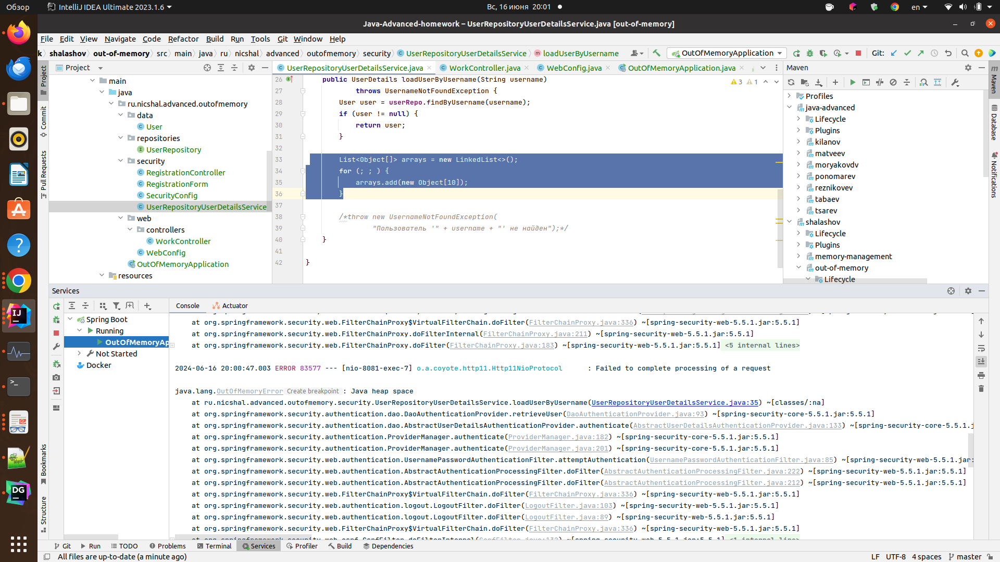
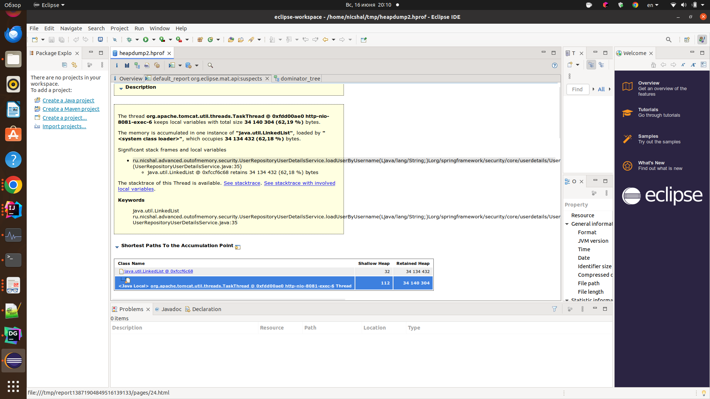
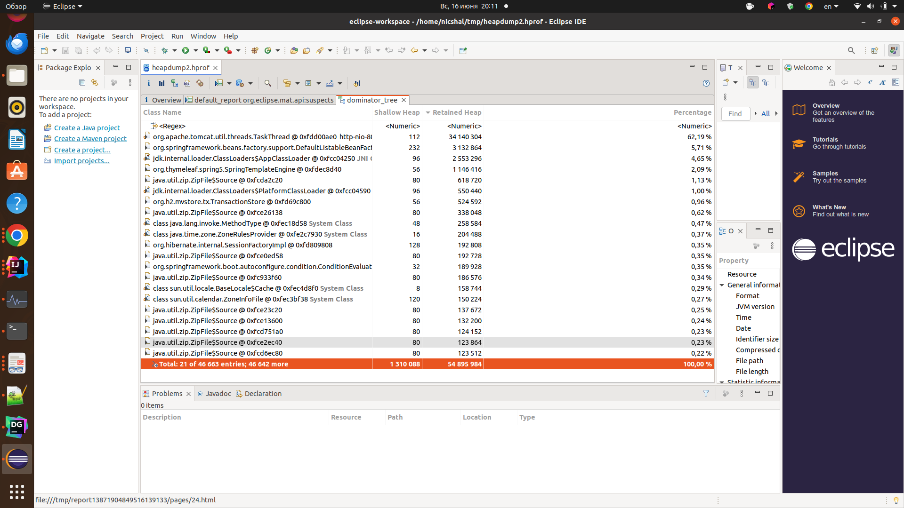
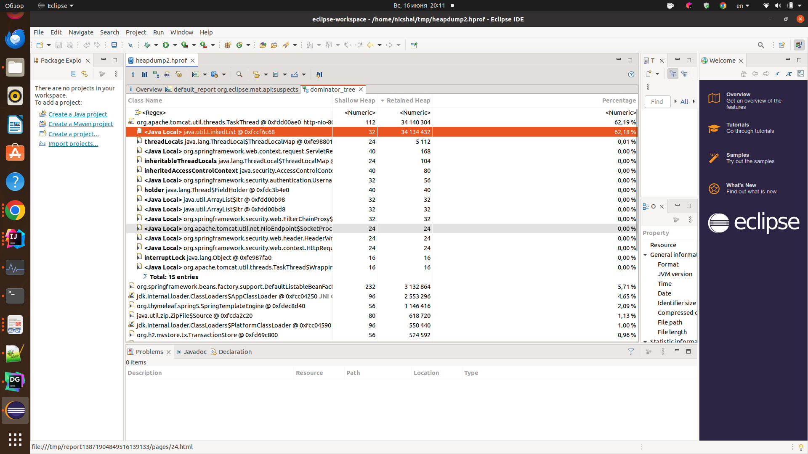

# Поиск утечки памяти в приложении

## Запуск приложения

 - Для запуска приложения требуется Java 17 или выше.
 - Приложение запускается с опциями: -Xmx56m -XX:+HeapDumpOnOutOfMemoryError -XX:HeapDumpPath=/home/nicshal/tmp/heapdump2.hprof

## Описание воспроизведения утечки памяти
 - запустить приложение с опциями -Xmx56m -XX:+HeapDumpOnOutOfMemoryError -XX:HeapDumpPath="путь_куда_сохранить_дапм"
 - зайти по адресу http://localhost:8081
 - попробовать зарегистрироваться
 - при вводе несуществующего логина-пароля (или при неправильном пароле) получаем ошибку

### Ошибка в приложении


Блок кода с ошибкой
```
List<Object[]> arrays = new LinkedList<>();
for (; ; ) {
    arrays.add(new Object[10]);
}
```

### Диагностика

При возникновении OutOfMemoryError был сохранен дамп heapdump2.hprof
Открываем дамп при помощи Eclipce Memory Analyzer
Выбираем «Leak Suspects Report», после этого откроется краткий обзор возможных утечек памяти:



Видим место, где проблема возникла и причину:
```
ru.nicshal.advanced.outofmemory.security.UserRepositoryUserDetailsService.loadUserByUsername(Ljava/lang/String;)Lorg/springframework/security/core/userdetails/UserDetails; (UserRepositoryUserDetailsService.java:35)
java.util.LinkedList @ 0xfccf6c68 retains 34 134 432 (62,18 %) bytes
```

Если вернуться на вкладку «Overview» и выбрать «Dominator Tree», то можно увидеть более подробную картину:




Видим, что израсходована вся выделеннач память (100%)
Израсходовано 62% на локальный LinkedList


## Запуск приложения
создать .jar -> shalashov/out-of-memory:package
выполнить
```
cd shalashov/out-of-memory
```
выполнить
```
docker build . -t out-of-memory:0.0.1
```
выполнить
```
docker images
```
```
REPOSITORY            TAG       IMAGE ID       CREATED          SIZE
out-of-memory         0.0.1     aa385cbaabac   17 seconds ago   457MB
couchbase/server      latest    7bae15cc376e   10 months ago    1.42GB
quay.io/coreos/etcd   latest    61ad63875109   6 years ago      39.5MB
```
выполнить (80 порт занят, использую порт 90)
```
docker imagesdocker run -d -p 90:8081 out-of-memory:0.0.1
```
выполнить
```
docker ps
```
```
CONTAINER ID   IMAGE                 COMMAND                  CREATED         STATUS         PORTS                                   NAMES
da6c43aa7409   out-of-memory:0.0.1   "/bin/bash /__cacert…"   9 seconds ago   Up 7 seconds   0.0.0.0:90->8081/tcp, :::90->8081/tcp   peaceful_hermann
```

Зайти в приложение по http://localhost:90/work

убиваем процесс
```
docker kill da6c43aa7409
```