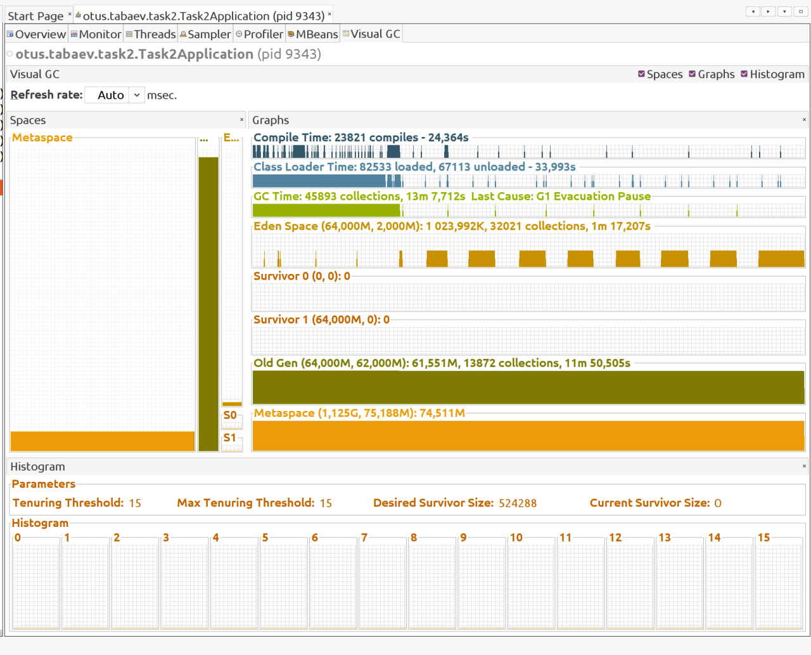
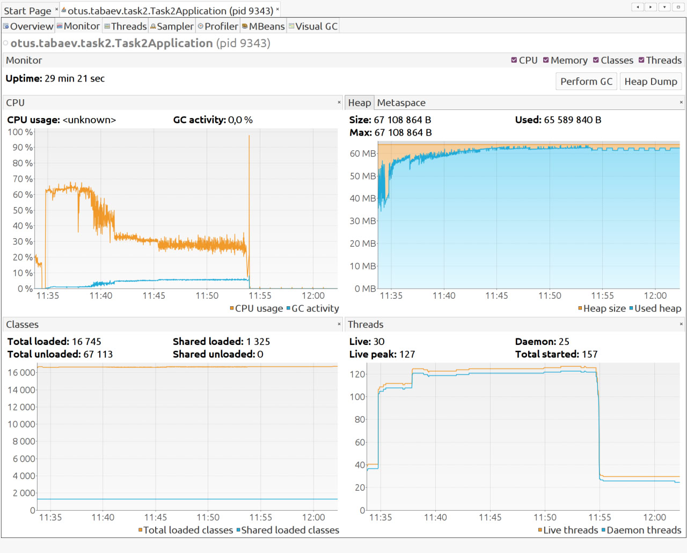
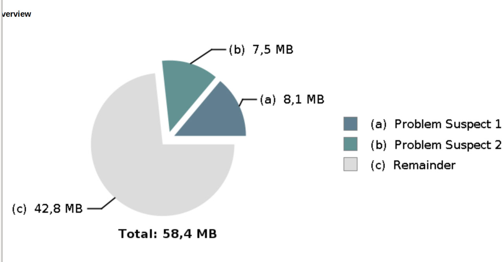
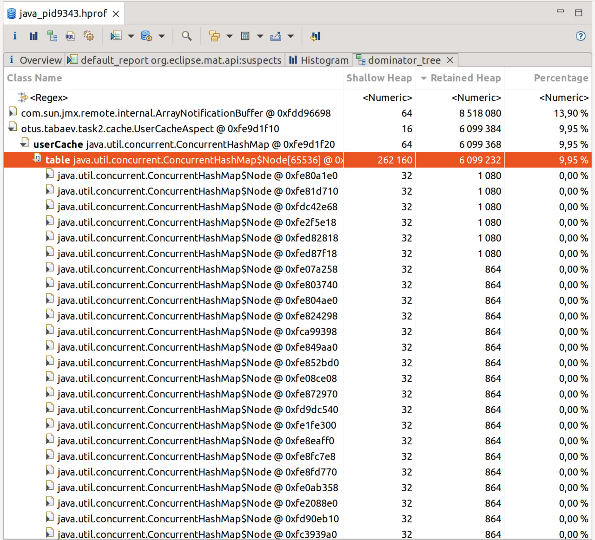
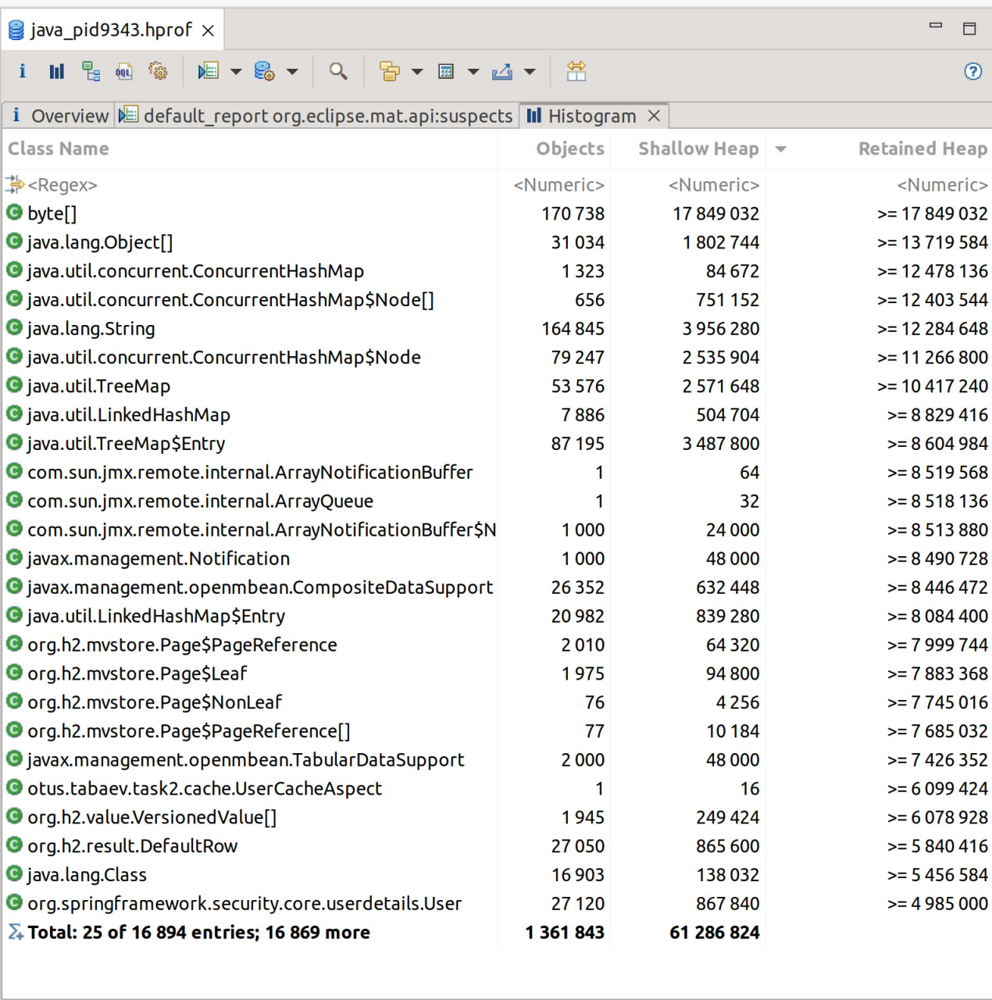

# Поиск утечки памяти в приложении

## Запуск приложения

Для запуска приложения требуется Java 17 или выше.

### С использованием Maven

Выполните следующие команды в корневой директории проекта:

```bash
mvn clean spring-boot:run
```

## Описание утечки 
В сервис авторизации был добавлен Аспект, который кэширует информацию о новых пользователях
(UserDetails).

## Диагностика утечки памяти

Приложению было выделено 64 мегабайта памяти для Heap, и в 
случае переполнения был создан heap dump. 
Для анализа были использованы инструменты, такие как VisualVM и 
Eclipse Analyzer.

### VisualVM

На приложение подавалась нагрузка в 150 запросов в секунду 
на регистрацию новых пользователей с помощью JMeter. 
С помощью программы VisualVM наблюдались процессы работы
сборщика мусора (GC) и заполнения кучи памяти.





### Eclipse Memory Analyzer


После возникновения ошибки OutOfMemory: Java heap,
приложение сгенерировало дамп памяти,
который был впоследствии проанализирован с
использованием программы Eclipse Memory Analyzer.



Анализ подозрений на утечку не привел к выявлению 
конкретных объектов, которые могут быть
причиной утечки памяти. Для более глубокого понимания
использования памяти было решено проанализировать гистограмму 
и дерево доминирования (Domination Tree).






Анализ дерева доминирования показал, что UserCacheAspect
становится источником утечки памяти, вероятно, из-за 
неправильной реализации кэша, где объекты не удаляются
после завершения их использования.

## Решение


