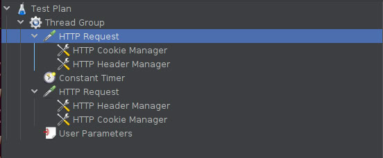
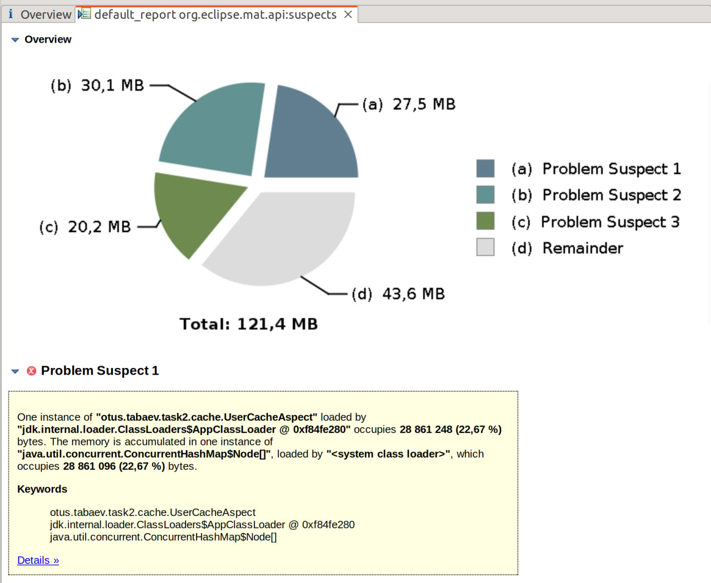
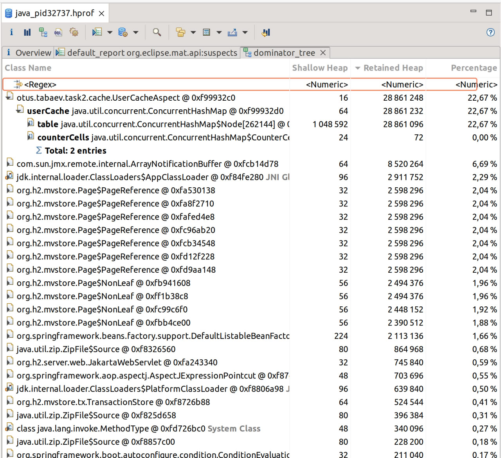

# Поиск утечки памяти в приложении

## Стек
Java 17, Spring-boot, Spring Data JPA, Spring Security, H2, FlyWay, Lombook

## Запуск приложения

Для запуска приложения требуется Java 17 или выше.

### С использованием Maven

Выполните следующие команды в корневой директории проекта:

```bash
export MAVEN_OPTS="-Xmx128m -XX:+HeapDumpOnOutOfMemoryError"
```

```bash
mvn clean spring-boot:run
```

## Описание утечки 
В сервис авторизации был добавлен Аспект, который кэширует информацию о новых пользователях
(UserDetails).

## Нагрузка 
Для нагрзки приложения используется программа JMeter. Сценарий 'Thread Group.jmx'
находится в корне проекта.
### Описание сценария
1. Регистрация пользователя с рандомным логином и с рандомным паролем
2. Перерыв 0.3 мск
3. Аутентификация пользователя




## Диагностика утечки памяти

При аутентификации пользователя происходит кэширование 
UserDetails пользователя. Приложению было выделено 64 мегабайта памяти для Heap, и в 
случае переполнения был создан heap dump. 
Для анализа были использованы инструменты, такие как VisualVM и 
Eclipse Analyzer.

### VisualVM

На приложение подавалась нагрузка в 150 запросов в секунду 
на регистрацию новых пользователей с помощью JMeter. 
С помощью программы VisualVM наблюдались процессы работы
сборщика мусора (GC) и заполнения кучи памяти.


### Eclipse Memory Analyzer


После возникновения ошибки OutOfMemory: Java heap,
приложение сгенерировало дамп памяти,
который был впоследствии проанализирован с
использованием программы Eclipse Memory Analyzer.


Анализ подозрений на утечку не привел к выявлению 
конкретных объектов, которые могут быть
причиной утечки памяти. Для более глубокого понимания
использования памяти было решено проанализировать гистограмму 
и дерево доминирования (Domination Tree).


Анализ дерева доминирования показал, что UserCacheAspect
становится источником утечки памяти, вероятно, из-за 
неправильной реализации кэша, где объекты не удаляются
после завершения их использования.

## Решение

В качестве хранения кэша выбрана структура данных Cache из библиотеки
Caffeine, которую можно конфигурировать в зависимости от потребностей
хранения кэша

## Повторный анализ

Увеличил Heap до 128 мб.
В результате размер кэша возрос до 22.67% от всего хипа
При анализе утечки памяти Eclipse Memory Analyzer нашел подозрение
на утечку памяти. Анализ дерева детерминирования подтвердил эту гипотезу.






