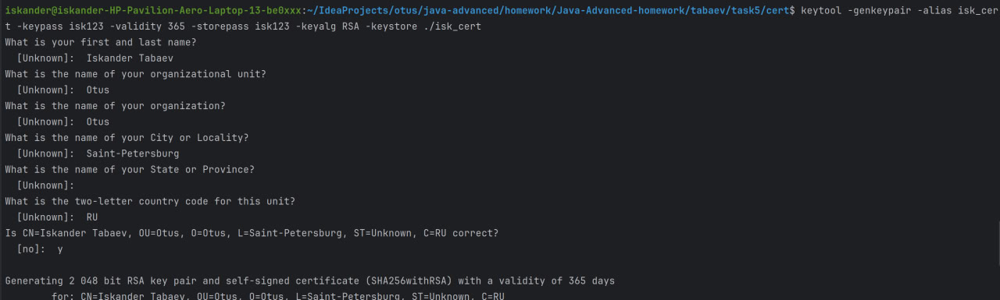
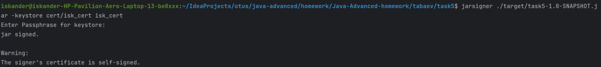
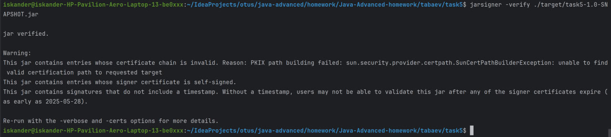
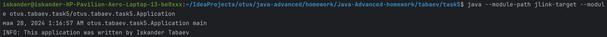
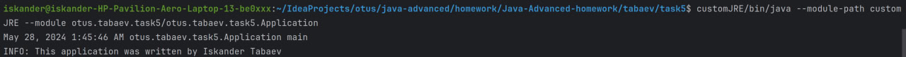

## Генерация сертификата с помощью keytool, подпись Jar файла

Генерация хранилища, пары ключей и сертификата
```bash
 keytool -genkeypair -alias isk_cert -keypass isk123 -validity 365 -storepass isk123 -keyalg RSA -keystore cert/isk_cert
 ```



Просмотр содержимого хранилища сертификатов и ключей
```bash
keytool -list -storepass isk123 -keystore cert/isk_cert
```

Просмотр сгенерированного сертификата isk_cert
```bash
keytool -list -v -alias isk_cert -storepass isk123 -keystore cert/isk_cert
```

Подпись JAR файла сгенерированным сертефикатом
```bash
jarsigner ./target/task5-1.0-SNAPSHOT.jar -keystore cert/isk_cert isk_cert
```


Проверка подписи JAR файла
```bash
jarsigner -verify ./target/task5-1.0-SNAPSHOT.jar 
```



## Создание JRE с помощью Jlink

Компиляция информации о модулях
```bash  
javac -d jlink-target ./src/main/java/module-info.java 
```
Компиляция класса
```bash
javac -d jlink-target --module-path jlink-target ./src/main/java/otus/tabaev/task5/Application.java
```

Запуск скомплированной програграммы
```bash
java --module-path jlink-target --module otus.tabaev.task5/otus.tabaev.task5.Application
```




Вывод информации о модулях
```bash
jdeps --module-path jlink-target -s --module otus.tabaev.task5
```

Создание JRE
```bash
jlink --module-path $JAVA_HOME/jmods:jlink-target --add-modules otus.tabaev.task5 --output customJRE
```

Запуск с использованием собственной JRE
```bash
customJRE/bin/java --module-path customJRE --module otus.tabaev.task5/otus.tabaev.task5.Application
```




