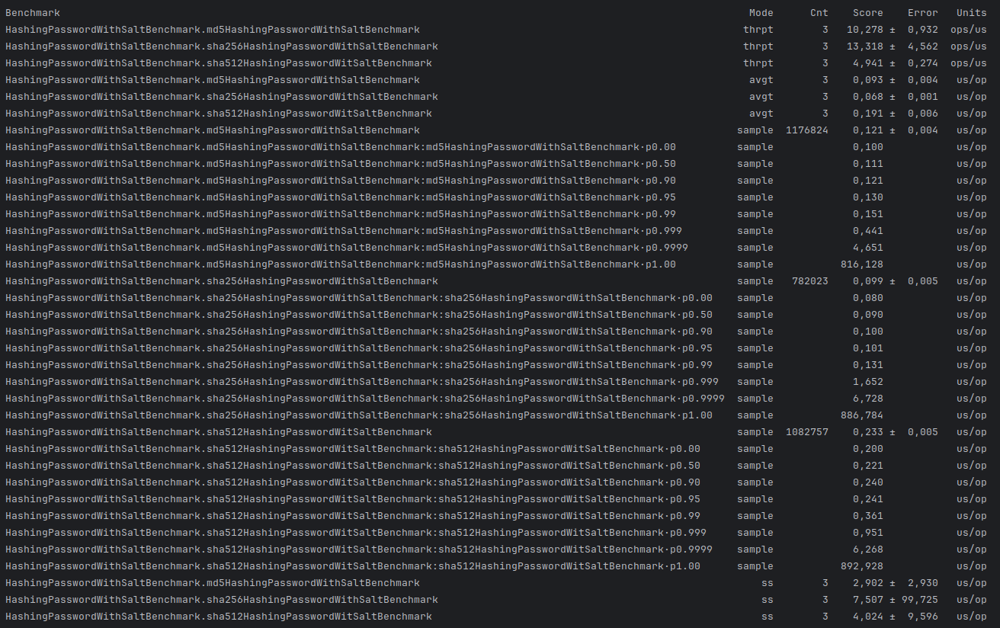

# Java Microbenchmark Harness

## Описание
Написание тестов производительности, используя библиотеку Java Microbenchmark Harness. [Инструкция по запуску JMH и Spring](https://gist.github.com/msievers/ce80d343fc15c44bea6cbb741dde7e45)

## Окружение

- **Процессор**: Ryzen 7 5700U
- **Память**: 16 GB RAM
- **Операционная система**: Ubuntu 24.04
- **Java**: Amazon Coretto 17.0.11

## Конфигурация JMH

- **Количество форков**: 0
- **Количество итераций для измерения**: 3
- **Количество итераций для прогрева**: 3
- **Количество потоков**: 1

## Запуск всех тестов
```bash
mvn clean test
```

## Тест прозводительности на логику хэширвования пароля с применением 3 разных алгоритмов: Md5, sha256, sha512 без использования соли


## Тест прозводительности на логику хэширвования пароля с применением 3 разных алгоритмов: Md5, sha256, sha512 с использованием соли



## Тест производительности на общий сервис регистрации клиента (без учёта инициализации spring, траспорта http rest)


## Итоги
Согласно тестам производительности, самым быстрым алгоритмом хеширования оказался SHA256, способный обрабатывать в среднем 13.318 операций в микросекунду. На втором месте по скорости находится алгоритм MD5, с производительностью 10.278 операций в микросекунду. Самым медленным из исследуемых алгоритмов оказался SHA512, который обрабатывает в среднем 4.941 операций в микросекунду.

Процесс регистрации пользователей требует больше ресурсов, так как включает обращение к базе данных и проверку уникальности логина. В среднем сервис способен обрабатывать 0.019 операций в миллисекунду или 19 операций в секунду.

Следует отметить, что все приведенные выше результаты уникальны для данных характеристик и не могут служить универсальным ориентиром.

## Зауск 3 различных тестов от  [https://hg.openjdk.org/code-tools/jmh/file/tip/jmh-samples/src/main/java/org/openjdk/jmh/samples/]

## JMHSample_01_HelloWorld


## JMHSample_05_StateFixtures


## JMHSample_12_Forking


