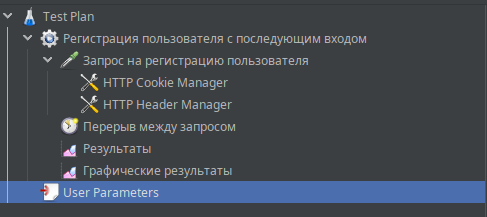
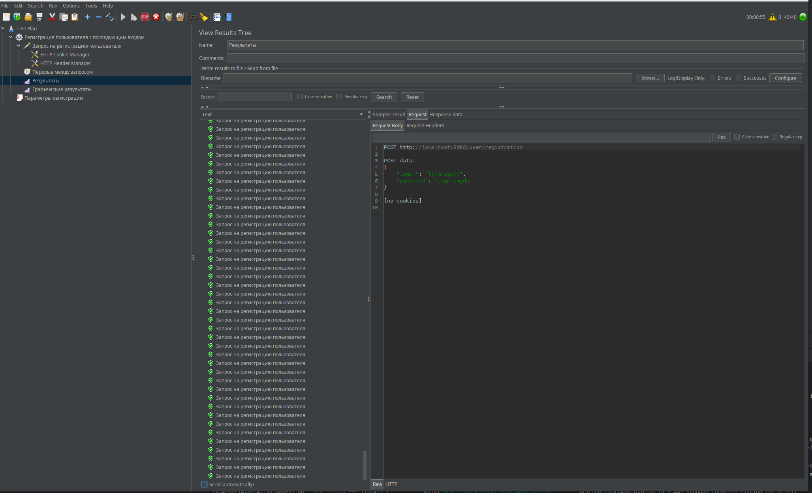
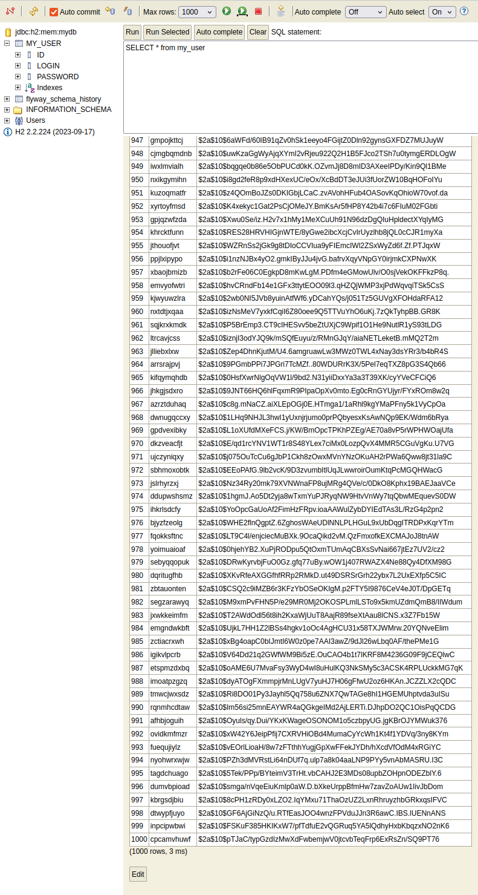

# Jmeter

## Описание
Реализация нагрзуки с использованием **Jmeter**

## Реализация нагрузки с использованием UI Jmeter

### Описание сценария

Для создания нагрузки была настроена группа потоков с 40 потоками, которые все запускаются в течение одной секунды.

Каждый поток отправляет запрос на регистрацию пользователя, где имя пользователя (username) и пароль (password) генерируются из случайной последовательности длиной 10 символов.

Между запросами в каждом потоке установлен интервал в 900 миллисекунд, что приблизительно обеспечивает нагрузку в 40 запросов в секунду (40 RPS).

Сценарий приложен Регистрация пользователя 40 RPS.jmx




### Результаты

Все запросы были успешно зарегистрированы и обработаны сервером. Пользователи с зашифрованными паролями корректно добавляются в базу данных. 
Сервер успешно справляется с текущей нагрузкой.





## Тесты через подмодуль Jmeter

### Описание

Тестовый сценарий Регистрация пользователя 40 RPS.jmx расположен в папке src/main/test/jmeter. 
Для запуска тестов использовался [Jmeter Maven Plugin](https://github.com/jmeter-maven-plugin/jmeter-maven-plugin)

### Запуск тестов Jmeter

1. **ВАЖНО: Поскольку это локальное тестирование, не забудьте запустить ваше API перед выполнением тестов производительности.**

2. Удаление строки `<ignoreResultFailures>true</ignoreResultFailures>` в `pom.xml`
Эта строка нужна для того, чтобы плагин `jmeter-maven-plugin` игнорировал ошибки в 
результатах выполнения тестов JMeter. Если вы её уберёте, Maven будет реагировать на любые ошибки, произошедшие в тестах.

3. Запуск тестов производительности Jmeter
```bash
mvn clean install -P performance-test 
```

### Результаты

Результаты JMeter показывают, что сервис нагружается примерно 40 запросами в секунду, и в среднем сервер отвечает на каждый запрос за 80 миллисекунд.
Ошибок в ответах при данной нагрузке в 40 RPS нет.
Более подробные данные доступны в папке target/jmeter/result.


